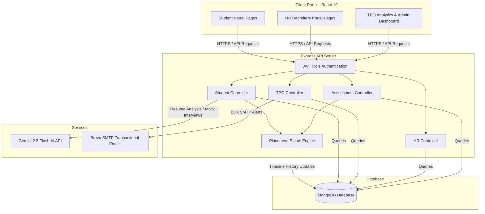
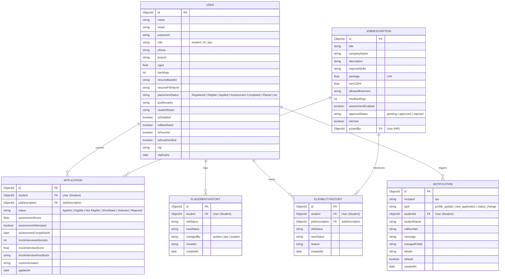
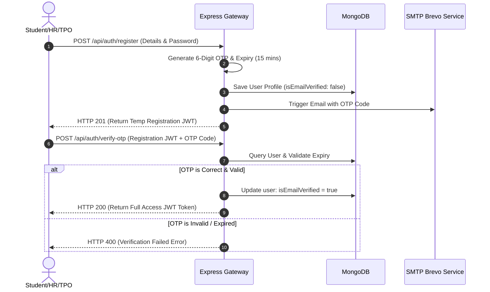
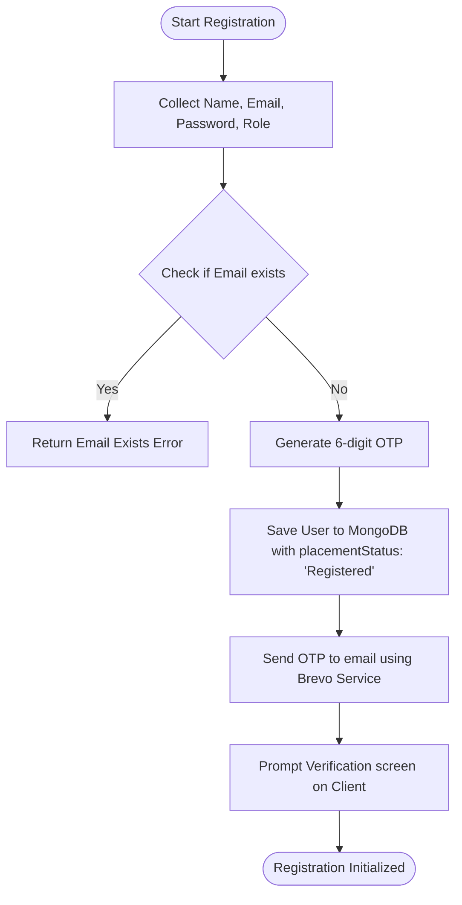
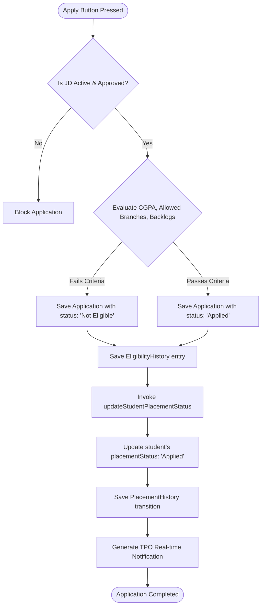
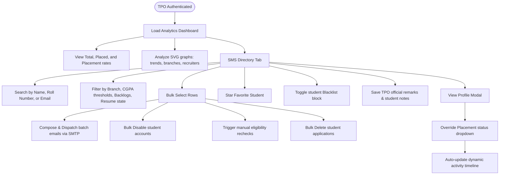
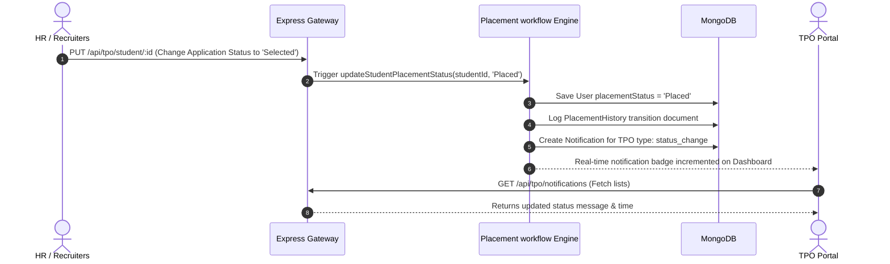

# HireLoop: Next-Gen Student Placement & Career Workflow Management System

HireLoop is a production-ready, portfolio-grade enterprise platform designed to streamline campus placements for educational institutions. The platform bridges the gap between **Students**, **HR Recruiters (Companies)**, and the **Training & Placement Office (TPO)**. 

Featuring automatic resume analysis, Gemini-powered mock interviews, custom visual SVG analytics dashboards, bulk directory operations, and real-time placement status timeline progression auditing, HireLoop transforms manual college coordination into an automated, data-driven workflow.

---

## Table of Contents
1. [System Architecture](#system-architecture)
2. [Database ER Diagram](#database-er-diagram)
3. [Core Workflow Diagrams](#core-workflow-diagrams)
4. [Project Directory Structure](#project-directory-structure)
5. [Core Features & Business Logic](#core-features--business-logic)
6. [API Route Specifications](#api-route-specifications)
7. [Frontend Architecture & Reusable Components](#frontend-architecture--reusable-components)
8. [Environment Configurations](#environment-configurations)
9. [Deployment Blueprints](#deployment-blueprints)
10. [Future Enhancements](#future-enhancements)

---

## System Architecture



---

## Database ER Diagram



---

## Core Workflow Diagrams

### Authentication & OTP Verification Flow



### Student Registration Flow



### Student Job Application Flow



### TPO Workflow



### Notification & Placement Status Flow



---

## Project Directory Structure

Below is the directory tree of the HireLoop codebase, mapping all production modules:

```
campusConnect/
├── client/                     # React 19 Frontend Web Client
│   ├── public/                 # Static Assets
│   └── src/
│       ├── assets/             # CSS styling stylesheets (index.css)
│       ├── components/         # Global Reusable Components
│       │   ├── Navbar.jsx      # Navigation Bar with role options
│       │   └── ProtectedRoute.jsx # Client-side JWT route protection wrapper
│       ├── context/
│       │   └── AuthContext.jsx # Global Context managing Auth, JWT storage, login state
│       ├── pages/              # Routing View Pages
│       │   ├── Login.jsx       # Login Screen (email, password)
│       │   ├── Register.jsx    # Signup Form (student & HR recruiter choices)
│       │   ├── VerifyOTP.jsx   # 6-Digit Verification screen
│       │   ├── StudentDashboard.jsx # Student panel (Applied jobs, assessment launcher, profile edit)
│       │   ├── HRDashboard.jsx # HR portal (Job creation, candidate shortlist, assessment builder)
│       │   └── TPODashboard.jsx # Admin panel (Analytics, SMS Directory, approvals, notifications)
│       ├── App.jsx             # React client Router mappings
│       ├── main.jsx            # React client mount root
│       ├── package.json        # Client configuration & dependency list
│       └── vite.config.js      # Vite compilation configurations
│
├── server/                     # NodeJS Express Backend Server
│   ├── config/
│   │   └── db.js               # MongoDB Mongoose driver setup
│   ├── controllers/            # Controller Business Logic Handlers
│   │   ├── authController.js   # JWT generation, signup, signin, OTP checks
│   │   ├── studentController.js # Profile edits, JD fetching, job applications
│   │   ├── hrController.js     # HR approvals, JD creation, application review
│   │   ├── tpoController.js    # SMS Directory querying, bulk actions, analytics, CSV reports
│   │   └── assessmentController.js # Gemini MCQ generator, result checker, test evaluation
│   ├── middleware/
│   │   └── authMiddleware.js   # HTTP Request JWT validation & role authority checks
│   ├── models/                 # MongoDB Mongoose collection models
│   │   ├── User.js             # User data schema (student/hr/tpo properties)
│   │   ├── JobDescription.js   # Job vacancy configuration parameters
│   │   ├── Application.js      # Link between Student and JD (status, scores, feedback)
│   │   ├── Assessment.js       # Gemini MCQs and passing thresholds
│   │   ├── AssessmentResult.js # Student MCQ test answers and percentages
│   │   ├── Notification.js     # System logs and change details for TPO
│   │   ├── EligibilityHistory.js # Auditing of student eligibility transitions
│   │   └── PlacementHistory.js # Audit logs of placement workflow transitions
│   ├── routes/                 # Express Router mappings
│   │   ├── authRoutes.js
│   │   ├── studentRoutes.js
│   │   ├── hrRoutes.js
│   │   ├── tpoRoutes.js
│   │   └── assessmentRoutes.js
│   ├── utils/                  # Helper script files
│   │   ├── checkEnv.js         # Env checking scripts
│   │   ├── sendEmail.js        # Brevo SMTP API Email utility
│   │   └── placementWorkflow.js # Status transition engine
│   ├── package.json            # Server package settings
│   └── server.js               # Node server startup file
└── README.md                   # Current documentation file
```

---

## Core Features & Business Logic

### 1. Automatic Eligibility Calculation
Whenever a student applies to a job, or updates their academic profile (CGPA, Branch, Backlogs), the backend triggers a validation check against the Job Description parameters:
*   **CGPA Check**: Compares `student.cgpa` with `jobDescription.minCGPA`.
*   **Branch Check**: Verifies `jobDescription.allowedBranches` array includes `student.branch`.
*   **Backlogs Check**: Checks if `student.backlogs` is less than or equal to `jobDescription.maxBacklogs`.

If the checks pass, application status is set to `'Applied'`. Otherwise, it is marked as `'Not Eligible'`, logging an auditing transition in `EligibilityHistory`.

### 2. Gemini AI Assessment Engine
Using Gemini 2.5 Flash, HireLoop dynamically creates tailored assessments for student job vacancies:
*   **Automatic Generation**: HR clicks "Generate questions". The server queries the job title and required skills, sending a structured prompt to Gemini.
*   **MCQ Validation**: Gemini outputs exactly 10 questions covering technical, logic, and behavioral topics. The server parses the response and stores it.
*   **Passing Thresholds**: If a student attempts the assessment, answers are checked. If their percentage is below the passing criteria, status transitions to `'Rejected'`.

### 3. Starred Favorites & Blacklist Blockers
*   **Favorite**: TPOs can star profiles. Starred favorites can be filtered quickly to present high-priority profiles to companies.
*   **Blacklist**: TPOs can blacklist profiles. Blacklisted students are blocked from applying to any job postings.

---

## API Route Specifications

Below are the primary backend endpoints exposed by the HireLoop service:

### Authentication Routes (`/api/auth`)
| Method | Endpoint | Access Role | Description |
| :--- | :--- | :--- | :--- |
| `POST` | `/register` | Public | Register new credentials, generates OTP |
| `POST` | `/login` | Public | Signin credentials, returns access token |
| `POST` | `/verify-otp` | Temp User | Verifies registration OTP codes |
| `POST` | `/resend-otp` | Temp User | Resends OTP email |

### TPO Portal Routes (`/api/tpo`)
| Method | Endpoint | Access Role | Description |
| :--- | :--- | :--- | :--- |
| `GET` | `/all-students` | TPO | Fetch all registered student accounts |
| `GET` | `/students` | TPO | Fetch SMS Directory candidates with filters |
| `POST` | `/students/bulk` | TPO | Bulk delete, email, whitelist/blacklist, disable |
| `PUT` | `/student/:id/flags` | TPO | Toggle favorites, edit notes & TPO remarks |
| `PUT` | `/student/:id/placement-status`| TPO | Manually update student workflow status |
| `GET` | `/student/:id/placement-timeline`| TPO | Fetch timeline status transition logs |
| `GET` | `/analytics` | TPO | Computes aggregates, package averages, trends |
| `GET` | `/reports/placements` | TPO | Downloads CSV placement report |
| `GET` | `/notifications` | TPO | Fetch notifications hub logs |
| `PUT` | `/notifications/read-all` | TPO | Mark all notifications read |

### Student Routes (`/api/student`)
| Method | Endpoint | Access Role | Description |
| :--- | :--- | :--- | :--- |
| `PUT` | `/profile` | Student | Edit academic and professional profile |
| `POST` | `/apply/:jdId` | Student | Submit job application and evaluate eligibility |
| `GET` | `/eligible-jds` | Student | View eligible and ineligible job postings |
| `GET` | `/applications` | Student | Get all job applications submitted |

### Recruiter HR Routes (`/api/hr`)
| Method | Endpoint | Access Role | Description |
| :--- | :--- | :--- | :--- |
| `POST` | `/jd` | HR | Create new job posting |
| `GET` | `/my-jds` | HR | View JDs posted by recruiter |
| `PUT` | `/application/:id/status`| HR | Update candidate application status |

---

## Frontend Architecture & Reusable Components

HireLoop uses a premium dark/navy styled interface featuring glassmorphic effects, harmonized color palettes, and responsive CSS grids:

### Reusable Components (`client/src/components/`)
1.  `Navbar.jsx`: Multi-role responsive navigation bar. Adjusts options based on the user's role:
    *   *Student*: Home, Eligible Jobs, My Applications, Profile.
    *   *HR Recruiter*: Post JD, Recruit candidates, Manage assessments.
    *   *TPO Portal*: Analytics, SMS Directory, Approvals.
2.  `ProtectedRoute.jsx`: Verifies JWT presence and role match before loading the page wrapper, redirecting unauthorized traffic to `/login`.

### Key Context Providers (`client/src/context/`)
*   `AuthContext.jsx`: Handles logging in, auth state, storing tokens in localStorage, and calling user profile details.

---

## Environment Configurations

Create a `.env` file in the `server/` directory:

```env
PORT=5000
MONGO_URI=mongodb+srv://<username>:<password>@cluster.mongodb.net/hireloop
JWT_SECRET=supersecretjwtauthkeyforhireloop
GEMINI_API_KEY=AIzaSyYourGeminiAPIKeyHere
SMTP_HOST=smtp-relay.brevo.com
SMTP_PORT=587
SMTP_USER=your_brevo_verified_email@gmail.com
SMTP_PASS=your_brevo_smtp_password
EMAIL_FROM=noreply@hireloop.com
```

---

## Deployment Blueprints

### Render Deployment (Backend Server)
1.  Log in to [Render](https://render.com) and create a **Web Service**.
2.  Connect your GitHub repository.
3.  Set the environment to **Node**.
4.  Configure the **Build Command**: `npm install` (under `server` directory).
5.  Configure the **Start Command**: `node server.js` (or configure using your server sub-root).
6.  Under **Environment Variables**, paste all config variables from your local `.env`.
7.  Deploy the service.

### Vercel Deployment (React Client)
1.  Log in to [Vercel](https://vercel.com) and link your GitHub repository.
2.  Choose the **Vite Project** preset.
3.  Set the **Root Directory** to `client`.
4.  Add Environment Variable `VITE_API_URL` pointing to your Render backend web service URL.
5.  Deploy the project.

---

## Future Enhancements

*   **Interview Scheduler**: Direct Integration with Google Calendar API for HR-scheduled student rounds.
*   **Resume Parsers**: Direct PDF text extraction utilizing OCR scanners to automatically fill student branch, CGPA, and skills fields.
*   **Advanced Charts**: Add canvas-based heatmaps and candidate skill mapping overlays.
